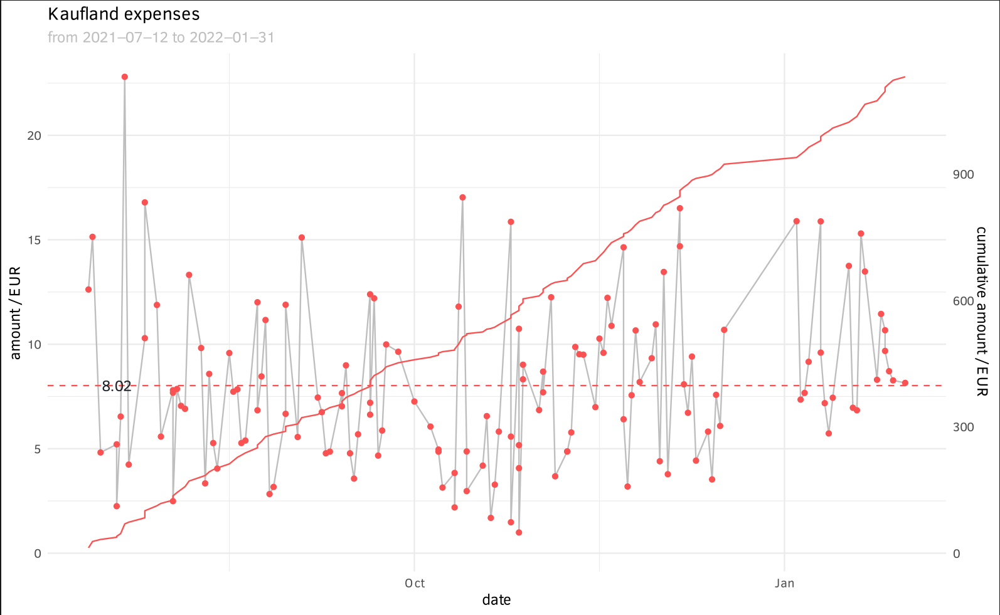
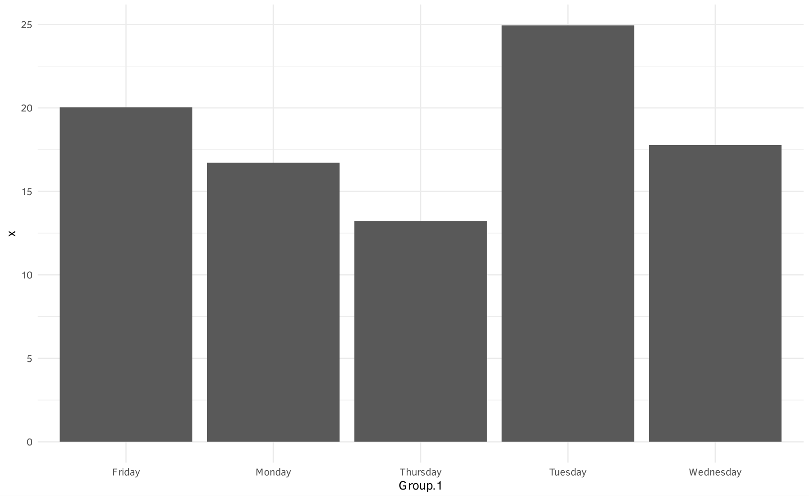
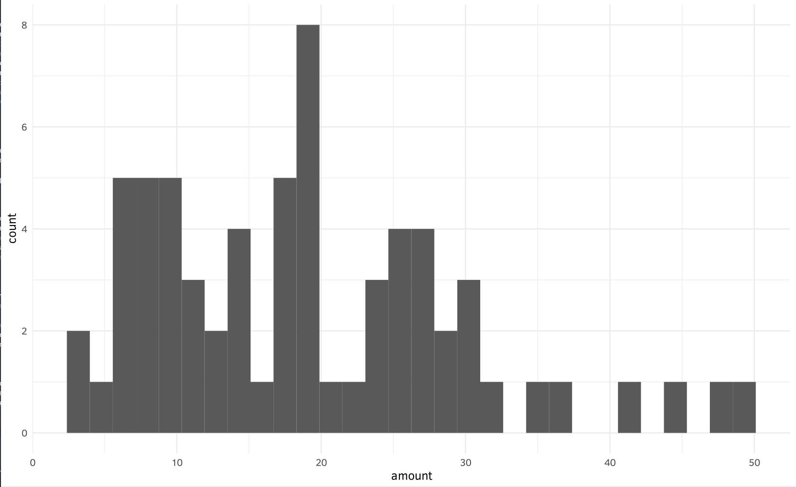

# SPK-graphz
sparkasse pdfs -> graph

this was before  I knew you could export csv directly from the website.. :D
so now it's also

sparkasse csv -> graph

## Features
- very bad and specific pdf to csv parser
- nice looking graphs, able to see history for specific expenses as well as statistical figures of merit and histograms

## Sample graphs

just some crude weekday means and histogram

